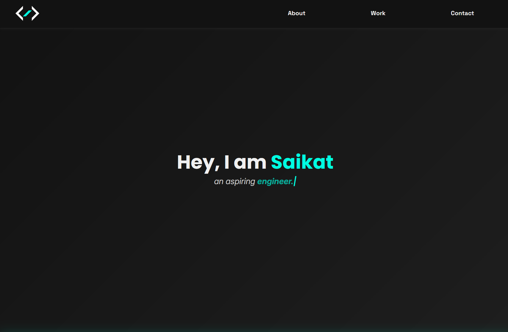
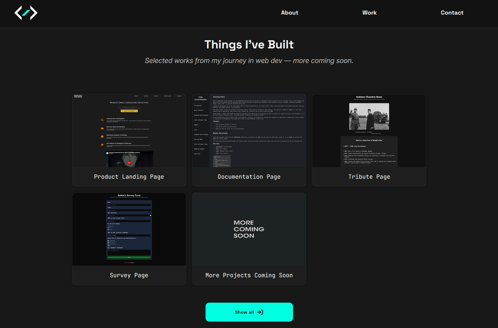
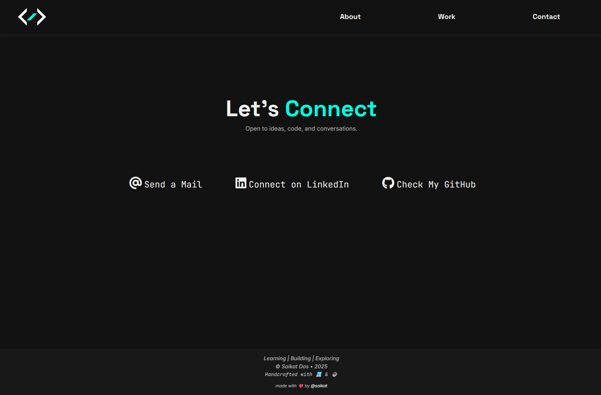

# Personal Portfolio Website

A responsive, modern, and aesthetically pleasing portfolio website showcasing my journey in web development. Built with **HTML**, **CSS**, and **JavaScript** to create a seamless user experience with subtle animations and interactive elements.

## Features

- **Responsive Design:** Fully optimized for all devices from mobile to desktop.
- **Modern Aesthetic:** Clean, minimal interface with a dark theme using #121212 as the primary color and teal (#00ffe1) accents.
- **Animated Elements:** Subtle JavaScript animations enhance the user experience without overwhelming the content.
- **Project Showcase:** Grid-based layout displaying my web development projects with hover effects.
- **Interactive Navigation:** Smooth scrolling and responsive navbar for easy site navigation.
- **Contact Section:** Multiple ways to connect, with interactive hover effects on social links.

## Preview

### Homepage


### Projects Section


### Contact Section
  

## Live Demo

Check out the live site here:  
[https://saikat-codes.github.io/portfolio-site/](https://saikat-codes.github.io/portfolio-site/)

## Technologies Used

- **HTML5**
- **CSS3** (`styles.css`)
- **JavaScript** (`script.js`)
- **Font Awesome** (Icons)
- **Google Fonts** (Space Grotesk, Inter, Poppins, JetBrains Mono)

## Project Structure
```
/portfolio
├── index.html
├── styles.css
├── new-colored-logo.png
├── favicon.png
└── README.md

```
## Key Components

- **Navbar:** Fixed navigation with logo and links.
- **Welcome Section:** Introduction with animated text elements.
- **Projects Grid:** Responsive 3-column grid (collapsing to single column on mobile).
- **Contact Section:** Social media and contact information with hover animations.
- **Footer:** Copyright information and additional links.

## CSS Features

- Custom hover effects with color transitions and shadows.
- Responsive grid layout using CSS Grid.
- Smooth transitions and transforms for interactive elements.
- Custom box shadows and gradients for depth and visual interest.

## JavaScript Functionality

- Text typing animations.
- Smooth scrolling navigation.
- Interactive project cards with hover effects.
- Responsive menu handling for mobile devices.


## Credits

Designed and developed by [Saikat Das](https://github.com/saikat-codes).


